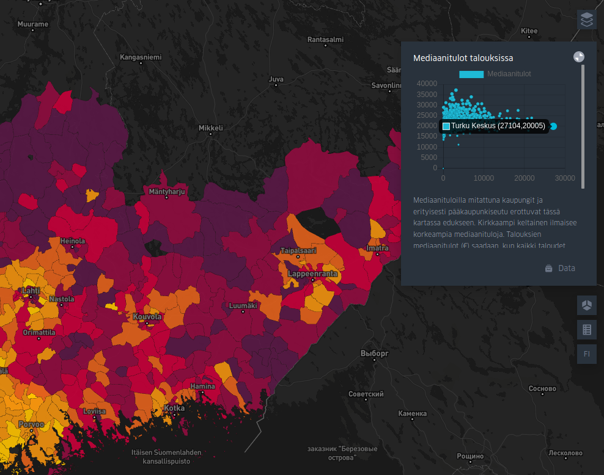

Ngz Geoviz
==========

Visualization for [Northern Growth Zone](http://www.kasvuvyohyke.fi/en/northern-growth-zone) using Kepler and Django. 
This repository is open source version of the project and contains only few of the original visualizations by default.
Check the [live site](https://ngz.gispocoding.fi/kepler/?locale=en) for all visualizations.




# Installation

Install Docker and docker-compose and register at [mapbox](https://www.mapbox.com/) to get Mapbox access token.


### Development mode

Make sure you have Node and Yarn installed.

Start the backend with:

```shell script
docker-compose -f docker-compose.yml up -d --build
```

And the frontend with: 

```shell script
export MapboxAccessToken=<your-access-token>
cd ngz_geoviz/frontend
yarn --ignore-engines
npm start
```

Now the frontend can be accessed from http://localhost:8080 and backend from http://localhost:8000.

If you build the frontend with `npm build` you can access it trough backend as well: http://localhost:8000/kepler

#### Using local Kepler.gl 

1. Run a build of the custom kepler.gl, such as [this fork](https://github.com/GispoCoding/kepler.gl) 
(branch feature_gispo_customizations)
1. run npm pack. This creates a .tgz zip file of your package with your custom modifications.
1. copy that file into the ngz-geoviz/frontend.
1. in frontend package.json replace the version number kepler to the following "kepler.gl": "file:my-packed-kepler.tgz"
1. Remove frontend/node_modules/kepler.gl
1. **Run** `yarn --ignore-engines` using your new package.json

### Production

1. Fill your MapboxAccessToken to docker-compose.prod.yml file.

2. Fill the following environmental variables to the .env.prod file (same directory as docker-compose.yml).
You can copy the .env.dev to get started. 
If you want to use AWS S3 for hosting the data, fill in your AWS credentials and set `USE_S3` to 1.
Database name, password and user could be anything, remember to use your own 
host instead of localhost if using in other host.

    ```shell script
    DEBUG=0
    HTTPS=0
    SECRET_KEY=very-secure-password
    USE_S3=0 
    AWS_ACCESS_KEY_ID=<your-id>
    AWS_SECRET_ACCESS_KEY=<secret-key>
    AWS_STORAGE_BUCKET_NAME=<your-bucket>
    MapboxAccessToken=your_mapbox_token
    DJANGO_ALLOWED_HOSTS=localhost 127.0.0.1 [::1]
    NGZ_BASE_URL=http://localhost:8000
    DJANGO_CORS_WHITELIST=http://localhost:8080 http://localhost:8081
   
    SQL_DATABASE=ngz_dev
    SQL_USER=ngz_dev_user
    SQL_PASSWORD=dev_pwd
    SQL_HOST=db
    SQL_PORT=5432
    DATABASE=postgres
    
    DJANGO_SUPERUSER_USERNAME=admin
    DJANGO_SUPERUSER_PASSWORD=very-secure-password
    DJANGO_SUPERUSER_EMAIL=your.email@domain.com
    ```

3. And following environmental variables to the .env.prod.db file (same directory as docker-compose.yml).
 Remember to use same values as in the .env.prod file.

    ```shell script
    POSTGRES_USER=ngz_admin_user
    POSTGRES_PASS=password
    POSTGRES_DB=ngz_prod
    ```

4. Spin up the app in production mode:

    ```shell script
    docker-compose -f docker-compose.prod.yml up -d --build
    ```

Nginx should now be listening on port 80.


#### Https configuration
Easiest way is to have the certificates on the host and add them as volumes to the host.
* Follow the [Certbot](https://certbot.eff.org/lets-encrypt/ubuntubionic-nginx) instructions to get the certificates
* Uncomment the line `- /etc/letsencrypt:/etc/letsencrypt` in docker-compose.prod.yml
* Modify .env.prod to contain right host in NGZ_BASE_URL and DJANGO_CORS_WHITELIST (DJANGO_CORS_WHITELIST=https://your.url.com http://localhost:8080 http://localhost:8000)
* Set HTTPS=1 in .env.prod 
* Edit all occurences of `server_name` in ngz-geoviz/nginx/nginx_https.conf to match your site
* Replace *ngz-geoviz/nginx/nginx.conf* with *ngz-geoviz/nginx/nginx_https.conf*, and run:

```shell script
docker-compose -f docker-compose.prod.yml down
docker-compose -f docker-compose.prod.yml up -d --build
```

Nginx should now be listening on port 443.

## Adding and editing visualizations

You can add more visualizations at http://localhost:8000/admin/. Take a look at example 
[fixture](ngz-geoviz/data/initial_visualizations.json) to get general idea about logic behind more complex cases.

Here are simple steps to add simple visualization:
1. Create visualization ad [Kepler.gl](https://kepler.gl/demo)
2. Click export map and download it as json file
3. Go to http://localhost:8000/admin/datahub/map/add/ and fill in the information:
    * id - your own id for your visualization
    * Image - screenshot of the visualization
    * Config - the json file you downloaded from kepler.gl
    * Details just add something to the details
4. The new visualization should be accessable from http://localhost:8080/


# Licenses
### Digitraffic
The Traffic Management Finland / digitraffic.fi, is licensed under the Creative 
Commons Attribution 4.0 International [license](https://creativecommons.org/licenses/by/4.0/). The application downloads
the data in real time using its Websocket interfaces.

### Paavo - Open data by postal code area
Postal code area boundaries, Statistics Finland The material was downloaded from Statistics Finland's 
interface service on 20 February 2020 with the [license](https://creativecommons.org/licenses/by/4.0/) CC BY 4.0.